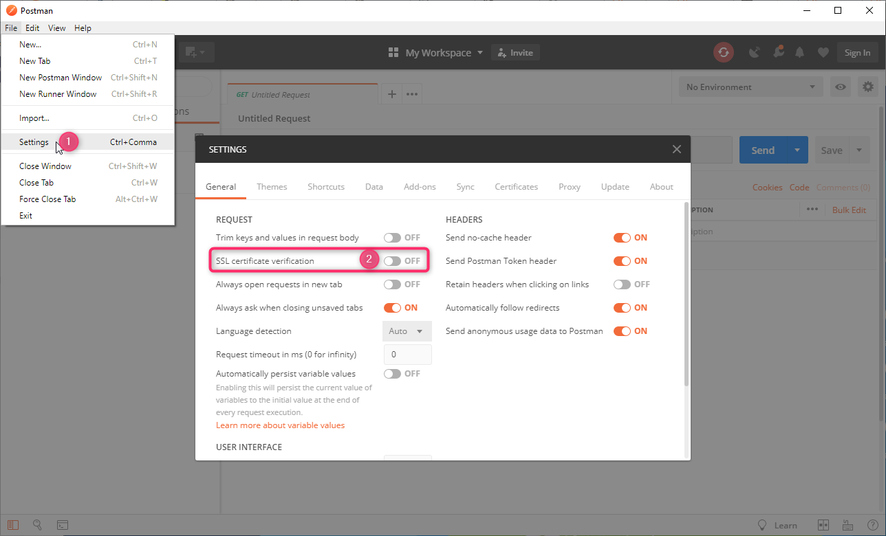
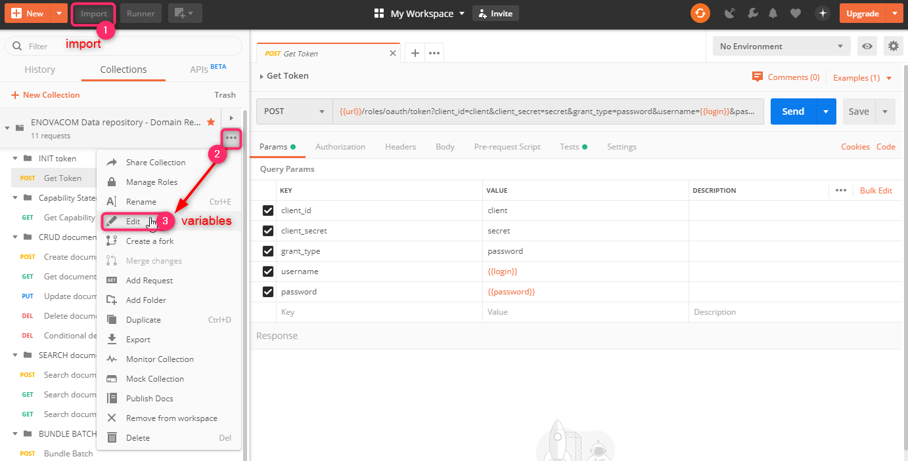
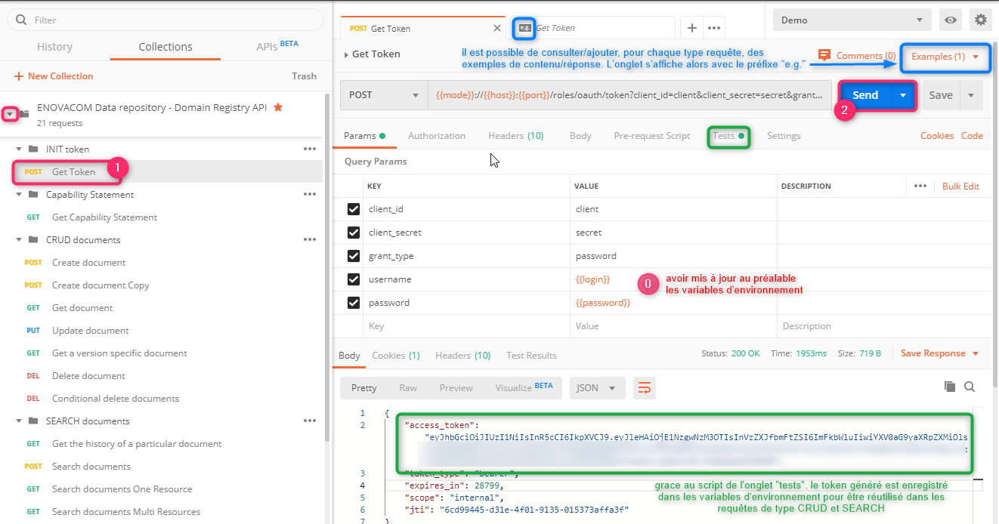

# Postman

## Contexte

Le projet Postman ``EDR_API`` est établi dans le cadre du site de démonstration cloud du produit ENOVACOM Data Repository \
(qui est livré de base sur un environnement https, avec un projet FHIR et un entrepôt local).

Y est exposée l'API FHIR :
- d'authentification (oAuth2)
- d'appel du Capability Statement
- de Création, Modification, Suppression, Lecture (CRUD)
- de Recherche simple et complexe
- d'insertion Bundle Batch.

## Démonstration

Ci-après une vidéo illustrant les étapes décrites ci-dessous : **[api-edr-demo.mp4](edr-demo.mp4)**

## Prérequis

S'être connecté une première fois avec son compte sur https://edr.enovacom.fr/enovacom-data-repository, et avoir créé un domaine FHIR-STU3 et/ou FHIR-R4.

Pour chaque domaine, avoir ajouté les ressources (onglet "Ressources") existentes.

## Import et configuration du projet

Pour utiliser ce projet, il convient de suivre les étapes suivantes :

**1. Installer et démarrer [Postman](https://www.getpostman.com/downloads/)**

:warning: Note : il est nécessaire (si cela n'est déjà fait) de désactiver la vérification du certificat SSL.

**2. Importer le projet**
- Cliquer sur ``Import`` (en haut à gauche - étape 1 sur la copie d'écran ci-dessous)
- Aller sur l'onglet ``Import file`` et importer le fichier **[EDR_API.postman_collection.json](EDR_API.postman_collection.json)**

**3. Configurer les variables**
- se positionner sur la collection et cliquer sur les 3 points (``...``) (cf. étape 2 dela copie d'écran)
- cliquer sur ``Edit`` (cf. étape 3 dela copie d'écran)
- puis sur l'onglet ``Variables``
- enfin, mettre à jour les variables collection requises :
   * url (par défaut https://edr.enovacom.fr/enovacom-data-repository/)
   * **login**,
   * **password**
   * **domainIdFhirSTU3** (par défaut fhir-stu3). Cet identifiant devra être utilisé pour les domaines rattachés au projet FHIR-STU3.
   * **domainIdFhirR4** (par défaut fhir-r4). Cet identifiant devra être utilisé pour les domaines rattachés au projet FHIR-R4.

Les variables sont ensuite appelées dans les requêtes sous la forme : ``{{variableName}}``.

## Utilisation

Il convient tout d'abord de lancer la requête ``Get Token``.

Cela permet de générer le "token d'authentification", qui va être enregistré dans les variables globales _(accessibles en cliquant sur ``Ctrl+Alt+E``)_ pour être ensuite utilisé dans les requêtes ultérieures.
Le token  a une durée limitée. Il conviendra de le re-générer à chaque session.

Il est également possible, pour chaque type de requête, de consulter des exemples (de contenu, réponses attendues, ...).

