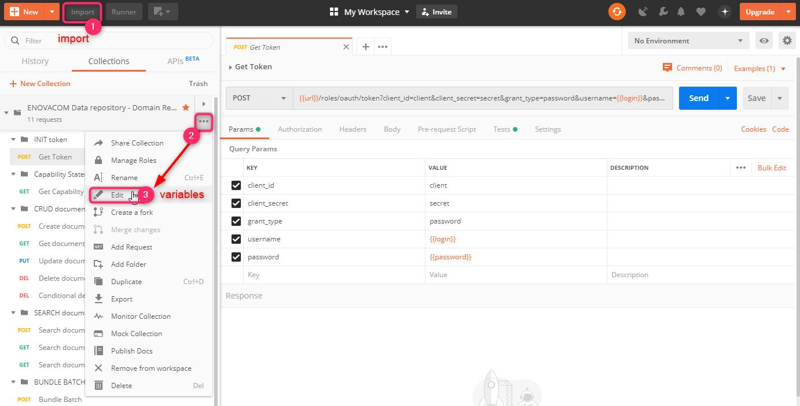
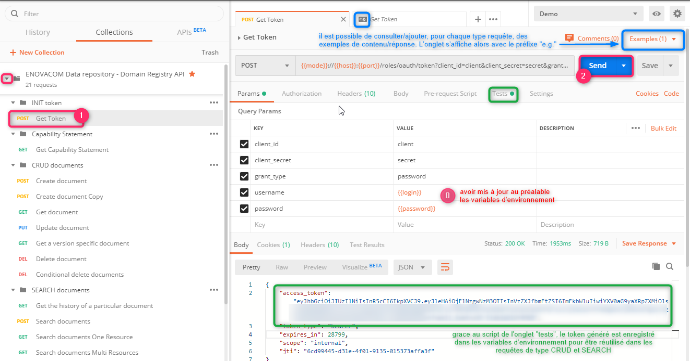

# Postman

## Contexte

Le projet Postman ``EDR_API`` est établi dans le cadre du site de démonstration cloud du produit ENOVACOM Data Repository (qui est livré de base sur un environnement https, avec un projet FHIR et un entrepôt local).

Y est exposée l'API FHIR :
- d'authentification (oAuth2)
- d'appel du Capability Statement
- de Création, Modification, Suppression, Lecture (CRUD)
- de Recherche simple et complexe
- d'insertion Bundle Batch.

## Démonstration

Ci-après une vidéo illustrant les étapes décrites ci-dessous : **[api-edr-demo.mp4](edr-demo.mp4)**

## Import et configuration du projet

Pour utiliser ce projet, il convient de suivre les étapes suivantes :

**1. Installer et démarrer [Postman](https://www.getpostman.com/downloads/)**

:warning: Note : il est nécessaire (si cela n'est déjà fait) de désactiver la vérification du certificat SSL.

**2. Importer le projet**
- Cliquer sur ``Import`` (en haut à gauche - étape 1 sur la copie d'écran ci-dessous)
- Aller sur l'onglet ``Import file`` et importer le fichier **[EDR_API.postman_collection.json](EDR_API.postman_collection.json)**

**3. Configurer les variables**
- se positionner sur la collection et cliquer sur les 3 points (``...``) (cf. étape 2 dela copie d'écran)
- cliquer sur ``Edit`` (cf. étape 3 dela copie d'écran)
- puis sur l'onglet ``Variables``
- enfin, mettre à jour les variables collection requises :
   * url (par défaut https://edr.enovacom.fr/enovacom-data-repository/)
   * **login**,
   * **password**
   * **domainIdFhirSTU3** (par défaut fhir-stu3). Cet identifiant devra être utilisé pour les domaines rattachés au projet FHIR-STU3.
   * **domainIdFhirR4** (par défaut fhir-r4). Cet identifiant devra être utilisé pour les domaines rattachés au projet FHIR-R4.

Les variables sont ensuite appelées dans les requêtes sous la forme : ``{{variableName}}``.

## Utilisation

Il convient tout d'abord de lancer la requête ``Get Token``.

Cela permet de générer le "token d'authentification", qui va être enregistré dans les variables globales _(accessibles en cliquant sur ``Ctrl+Alt+E``)_ pour être ensuite utilisé dans les requêtes ultérieures.
Le token  a une durée limitée. Il conviendra de le re-générer à chaque session.

Il est également possible, pour chaque type de requête, de consulter des exemples (de contenu, réponses attendues, ...).

